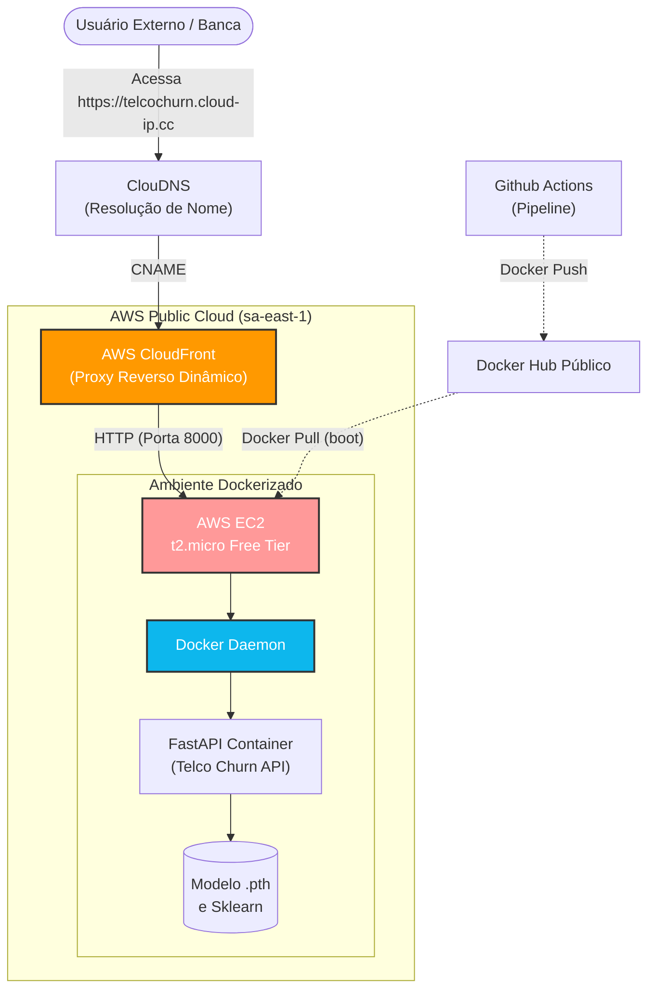

# Arquitetura de Nuvem AWS

Para provisionar o modelo preditivo em nuvem garantindo os requisitos de **Custo Zero** (100% elegível ao Free Tier), **Segurança (HTTPS)** e **Gestão Simplificada**, a arquitetura projetada baseia-se em uma abordagem IaaS configurada de maneira transparente, operando como um ecossistema PaaS/Serverless na ótica de quem faz o deploy.

## Diagrama da Infraestrutura

## Componentes

### 1. AWS EC2 (`t2.micro`)
A computação é baseada em uma máquina Amazon Linux 2023. O grande trunfo arquitetural está no seu ciclo de vida efêmero:
* Não configuramos servidores via SSH.
* A máquina é instanciada e, através de um script de **User Data**, ela atualiza os pacotes essenciais, instala o Docker, realiza o *Pull* da imagem oficial da API e roda o serviço. 
* Trata-se de um "Serverless improvisado" para garantir o custo zero no longo prazo.

### 2. AWS CloudFront & ACM (Custom Domain)
Sistemas expostos em IPs públicos puros são penalizados por navegadores pela ausência de SSL (Cadeado Verde). Utilizamos o CloudFront como **Proxy Reverso gratuito** para englobar nossa instância. 

Para alcançar excelência de mercado sem custo, utilizamos:
* **ClouDNS**: Provedor externo gratuito que permite Gestão de Zona DNS. Registramos o domínio `telcochurn.cloud-ip.cc`.
* **AWS Certificate Manager (ACM)**: Emitimos um certificado TLS/SSL oficial na região da Virgínia (`us-east-1`), comprovando a posse do domínio via registro CNAME no ClouDNS.
* Com o certificado acoplado ao CloudFront, garantimos acesso HTTPS através de um domínio completamente amigável à banca, mascarando a infraestrutura subjacente.

### 3. Terraform (Infraestrutura como Código)
Todos os componentes citados são provisionados pelo manifesto localizado em `terraform/`. 

## Decisões Técnicas (Trade-offs)
* **Por que EC2 em vez de AWS App Runner?** O AWS App Runner exigiria pagamentos diários (não é elegível ao plano gratuito infinito) e forçaria o redirecionamento da esteira CI/CD do Docker Hub para o ECR. A solução atual utiliza o Free Tier e não onera os custos da conta do estudante.
* **Por que "Ligar/Desligar"?** Com os comandos Terraform (seja via Makefile ou Github Actions), podemos levantar a infraestrutura na hora exata da apresentação e destruí-la com apenas um clique imediatamente depois, neutralizando qualquer risco de faturamento excedente de disco EBS ou IPs elásticos.
